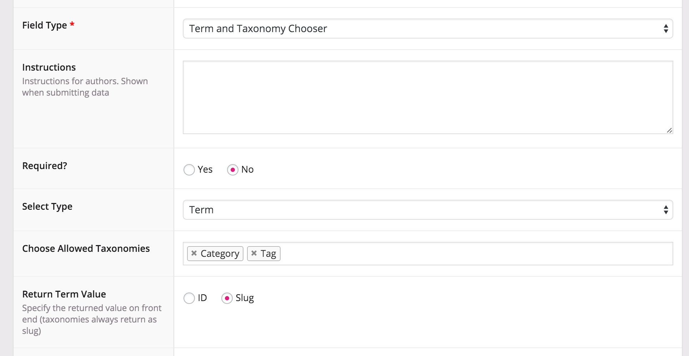
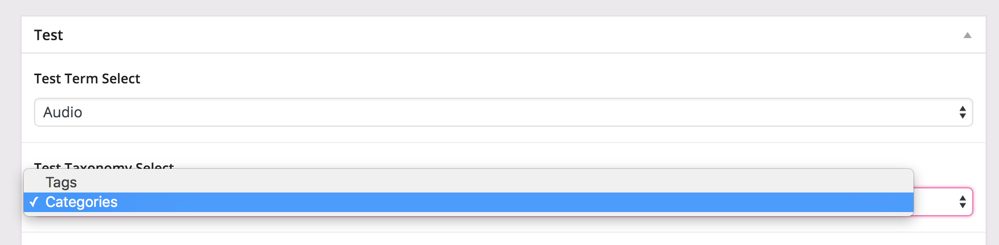

# Advanced Custom Fields Term and Taxonomy Chooser

Used with ACF (for WordPress) to select a term or an entire taxonomy from a list of multiple allowed taxonomies.

-----------------------

### Description

Advanced Custom Fields comes with a basic taxonomy field, but this limits you to only showing the terms from one taxonomy at a time. What if you want to show the terms from multiple taxonomies, or select the taxonomy itself?

Term and Taxonomy Chooser adds a custom field type to ACF that lets you set whether you want to show a "Term" or "Taxonomy", a multiselect option of which Taxonomies to choose from, and whether you want to return the ID or the Slug (Terms only, Taxonomies just return slug)

When using the field in the editor, it will be a drop menu that lets you select a single term or a single taxonomy.

Compatible with Advanced Custom Fields v5/Pro

### FAQ

1. Why would I want to use a taxonomy instead of a term?
Lots of reasons! Though there's no such thing as a "taxonomy archive", you might want to display all terms in a selected taxonomy as a list of links, for example.

2. Why can't I select multiple terms?
That's not how this is built. There is a multi-select taxonomy term ACF plugin out there already that you can use to select multiple terms from multiple taxonomies, or use ACF's built in Taxonomy field to select multiple terms from a single taxonomy.

### Installation

1. Copy the `acf-taxonomy-chooser` folder into your `wp-content/plugins` folder
2. Activate the Term and Taxonomy Chooser plugin on the Plugins admin page
3. When creating a new field in ACF, select Term and Taxonomy Chooser

### Compatibility

This ACF field type is compatible with:
* ACF 5

### Structure

* `/js`: folder for .js files
* `/lang`: folder for .pot, .po and .mo files
* `/assets`: screenshots for reference
* `acf-taxonomy-chooser.php`: Main plugin file that includes the correct field file based on the ACF version
* `taxonomy-chooser-v5.php`: Field class compatible with ACF version 5 
* `readme.txt`: WordPress readme file to be used by the WP repository

### Changelog

= 1.0.0 =
* Initial Release

### Screenshots

An example of the Advanced Custom Fields GUI with the new custom field, showing all the settings

An example of use case within the post editor, showing the taxonomies (useful if you want to output a list of all terms in a taxonomy, for example)

